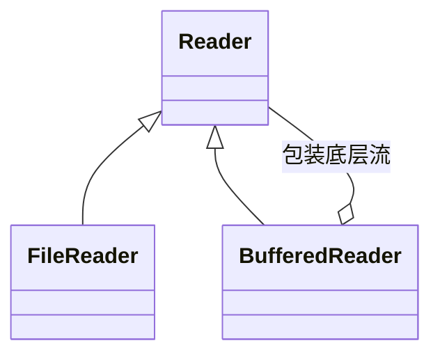

`java.io.Reader` 是**字符输入流的抽象基类**，所有字符输入流都直接或间接继承自它，负责把字节按字符集**解码**成字符后读入程序。

## Usage

`Reader` 是抽象类，不能直接 `new`，日常使用的是它的两个常见子类：

| 类                                                 | 角色     | 说明                                                                                |
| -------------------------------------------------- | -------- | ----------------------------------------------------------------------------------- |
| [`FileReader`](/docs/java/api/file-reader)         | 数据源流 | 直接连接文件，使用平台默认字符集解码                                                |
| [`BufferedReader`](/docs/java/api/buffered-reader) | 包装流   | 包装另一个 `Reader`（通常是 `FileReader`），增加内存缓冲区，并额外提供 `readLine()` |



- `FileReader` 决定“从哪里读”，`BufferedReader` 决定“怎么读得更快”，两者可以叠加使用（也是实际开发的标准写法）：

```java
try (BufferedReader reader = new BufferedReader(new FileReader("test.txt"))) {

    String line;

    while ((line = reader.readLine()) != null) {
        System.out.println(line);
    }

}
```

## Methods

> `Reader` 是抽象类，下面的示例统一用 `FileReader` 演示，`BufferedReader` 的用法完全相同。

### read()

读取一个字符（使用对应的编码集**解码**成二进制数）

```java
public int read() throws IOException
```

- Return：读取到的字符编码值（`0 ~ 65535`）；到达文件末尾时返回 `-1`，读取失败抛出 `IOException`

```java
FileReader reader = new FileReader("test.txt");

int data;

while ((data = reader.read()) != -1) {
    System.out.print((char) data);
}

reader.close();
```

### read(char[] cbuf)

读取到字符数组

```java
public int read(char cbuf[]) throws IOException
```

- cbuf：用于存放读取数据的字符数组（缓冲区）
- Return：本次实际读取到的字符数；到达文件末尾（没有更多数据）时返回 `-1`

```java
FileReader reader = new FileReader("test.txt");

char[] buffer = new char[1024];

int len;

while ((len = reader.read(buffer)) != -1) {
    System.out.print(new String(buffer, 0, len));
}

reader.close();
```

**注意**：`read(cbuf)` 不保证把数组填满，返回值可能**小于 `cbuf.length`**；必须使用返回值 `len` 作为本次读取的有效长度。

### read(char[] cbuf, int off, int len)

读取到字符数组的指定范围，是 `read(char[] cbuf)` 的重载

```java
public int read(char cbuf[], int off, int len) throws IOException
```

- off：从数组的哪个下标开始存放读取到的字符
- len：最多读取的字符个数
- Return：实际读取到的字符数；到达文件末尾时返回 `-1`

### ready()

判断此流是否已准备好被读取，返回 `true` 时下一次 `read()` 不会阻塞。

```java
public boolean ready() throws IOException
```

### close()

关闭流并释放资源；关闭后再次调用 `read()` 会抛出 `IOException`。

```java
public void close() throws IOException
```

> `BufferedReader` 这类包装流的 `close()` 会**级联关闭**被包装的底层流（如 `FileReader`）。
