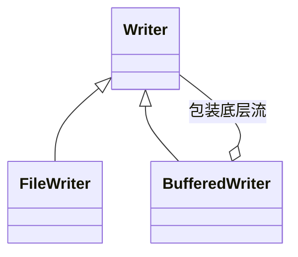

`java.io.Writer` 是**字符输出流的抽象基类**，所有字符输出流都直接或间接继承自它，负责把字符按字符集**编码**成字节后写入目标。

## Usage

`Writer` 是抽象类，不能直接 `new`，日常使用的是它的两个常见子类：

| 类                                                 | 角色       | 说明                                                                |
| -------------------------------------------------- | ---------- | ------------------------------------------------------------------- |
| [`FileWriter`](/docs/java/api/file-writer)         | 数据目标流 | 直接写入文件，使用平台默认字符集编码                                |
| [`BufferedWriter`](/docs/java/api/buffered-writer) | 包装流     | 包装另一个 `Writer`（通常是 `FileWriter`），增加内存缓冲区，并额外提供 `newLine()` |



- `FileWriter` 决定“写到哪里”，`BufferedWriter` 决定“怎么写得更快”，两者可以叠加使用（也是实际开发的标准写法）：

```java
try (BufferedWriter writer = new BufferedWriter(new FileWriter("test.txt"))) {

    writer.write("hello");
    writer.newLine();
    writer.write("你好");

}
```

## Methods

> `Writer` 是抽象类，下面的示例统一用 `FileWriter` 演示，`BufferedWriter` 的用法完全相同。

### write(int c)

写入一个字符（使用指定编码集**编码**成二进制数）

```java
public void write(int c) throws IOException
```

- c：要写入的字符编码值，只取低 16 位（一个字符）；写入失败抛出 `IOException`

```java
try (FileWriter writer = new FileWriter("test.txt")) {

    writer.write('A');

}
```

### write(char[] cbuf)

写入整个字符数组

```java
public void write(char cbuf[]) throws IOException
```

- cbuf：要写入的字符数组；写入失败抛出 `IOException`

```java
try (FileWriter writer = new FileWriter("test.txt")) {

    char[] chars = {'a', 'b', 'c'};

    writer.write(chars);

}
```

### write(char[] cbuf, int off, int len)

写部分字符数组

```java
public void write(char cbuf[], int off, int len) throws IOException
```

- off：起始偏移量（从数组的哪个下标开始写）
- len：要写入的字符个数；写入失败抛出 `IOException`

```java
try (FileWriter writer = new FileWriter("test.txt")) {

    char[] chars = {'a', 'b', 'c', 'd'};

    writer.write(chars, 1, 3); // 写入 bcd

}
```

### write(String str)

写入一个字符串

```java
public void write(String str) throws IOException
```

- 字符流可以直接写入字符串，不需要先转成字符数组，这是它比字节流方便的地方

```java
try (FileWriter writer = new FileWriter("test.txt")) {

    writer.write("hello 你好");

}
```

### write(String str, int off, int len)

写部分字符串

```java
public void write(String str, int off, int len) throws IOException
```

- off：字符串的起始下标
- len：要写入的字符个数；写入失败抛出 `IOException`

```java
try (FileWriter writer = new FileWriter("test.txt")) {

    writer.write("hello", 1, 3); // 写入 ell

}
```

### flush()

把缓冲区中的数据立即刷入文件。`close()` 会自动调用 `flush()`，但在关闭前想立即落盘（比如写完马上读文件）时要手动调用。

```java
public void flush() throws IOException
```

```java
FileWriter writer = new FileWriter("test.txt");

writer.write("hello");

writer.flush(); // 立即写入文件

writer.close();
```

<Accordions type="single">
  <Accordion title="为什么不能“写一次就存一次磁盘”？">

    对 CPU 和内存来说，访问磁盘/外设的速度极其缓慢：

- 内存读写速度通常在 纳秒（ns） 级别。
- 磁盘 I/O 读写速度通常在 毫秒（ms） 级别（相差上万倍甚至上百万倍）。

如果程序每调用一次 writer.write("a") 就直接触发一次真正的磁盘写入，CPU 会花大量的等待时间在磁盘 I/O 操作上，导致程序整体性能急剧下降。

  </Accordion>

  <Accordion title="缓冲区的解决方案">
  为了解决这个问题，写入流会在内存中开辟一块缓冲区（Buffer，比如默认 8KB 的字符/字节数组）：

- 当你调用 write() 时，数据并没有直接写到文件里，而是先暂存在内存的缓冲区中。
- 只有当缓冲区被塞满时，系统才会把缓冲区里的数据一次性批量写入磁盘。这样可以将成千上万次微小的 I/O 操作合并为一次，极大提升读写效率。

flush() 的本质工作就是：强制刷新缓冲区，将当前暂存在内存缓冲区中的所有数据立刻发送并写入到目标介质（文件、网络 Socket 等）中，即使缓冲区还没满。

  </Accordion>
</Accordions>

### close()

关闭流并释放资源；关闭前会自动 `flush()`；关闭后再次写入会抛出 `IOException`。

```java
public void close() throws IOException
```

> `BufferedWriter` 这类包装流的 `close()` 会**级联关闭**被包装的底层流（如 `FileWriter`）。
